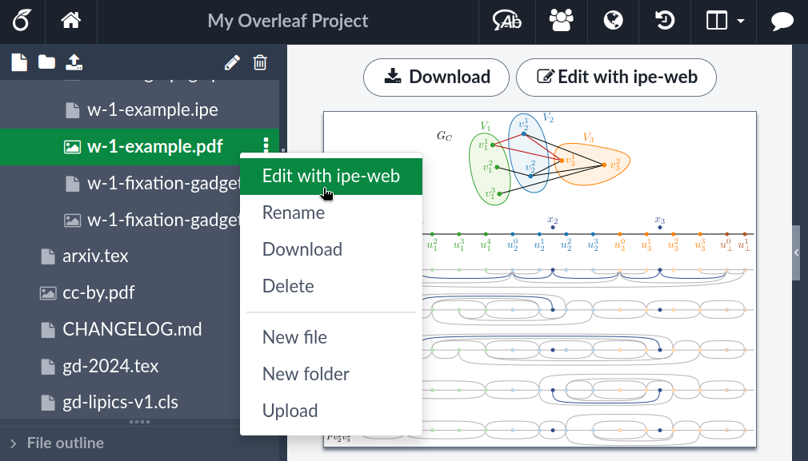

# ipe-overleaf

This is a browser extension that adds a button to file menus on [overleaf.com](https://www.overleaf.com/) that allows you to open
the file with [ipe-web](https://ipe-web.otfried.org/), edit it there, and seamlessly upload it back to overleaf.
On the one hand, this is not affiliated with or endorsed by Overleaf in anyway.
On the other hand, [Otfried](https://otfried.org/) kind of thinks this is cool, [I guess](https://github.com/N-Coder/ipe-overleaf/commit/a4e43f72fe3170f2559edf6d300fe3da87b4db50).

## Installation

Currently only via a local checkout of this repo and using Firefox 
[developer mode](https://developer.mozilla.org/en-US/docs/Mozilla/Add-ons/WebExtensions/Your_first_WebExtension#installing). 

## ToDo

- what to do when "Open in ipe-web" is clicked a second time?
  Maybe compare timestamps in ipe files and ask whether we should overwrite?
- instead of opening a new tab for "ipe-web", check whether the file is already open
- do not fail the upload if the overleaf tab was closed in the meantime
- when uploading an ipe file, we should probably also upload the pdf version
- check whether we can also message the native ipe installation
